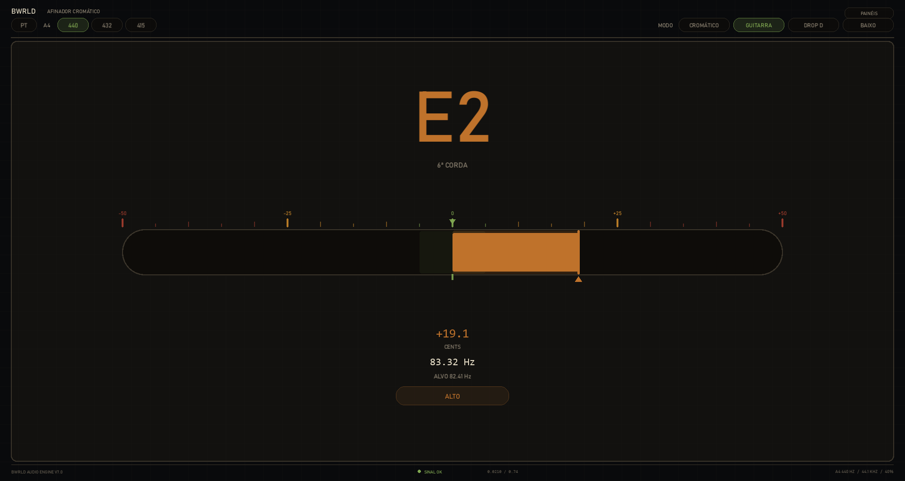
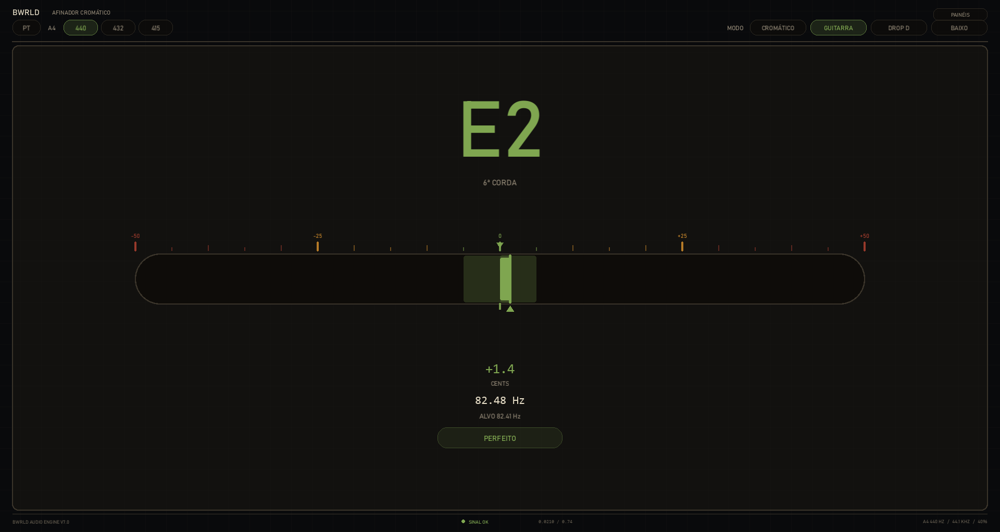
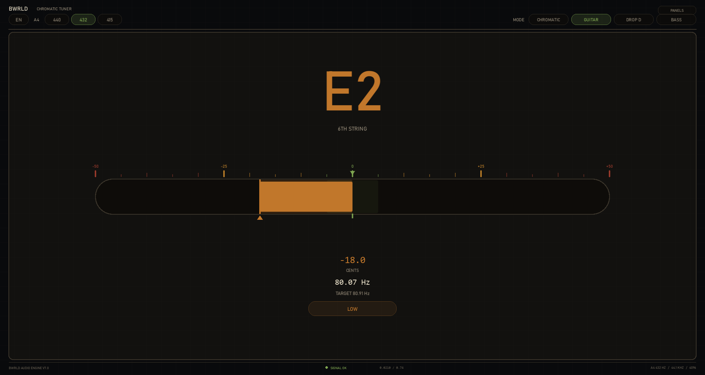
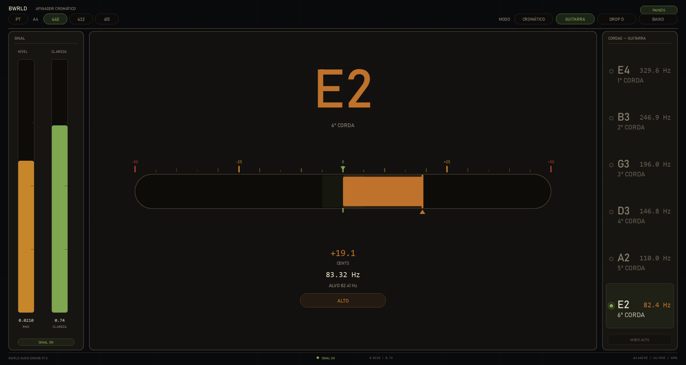
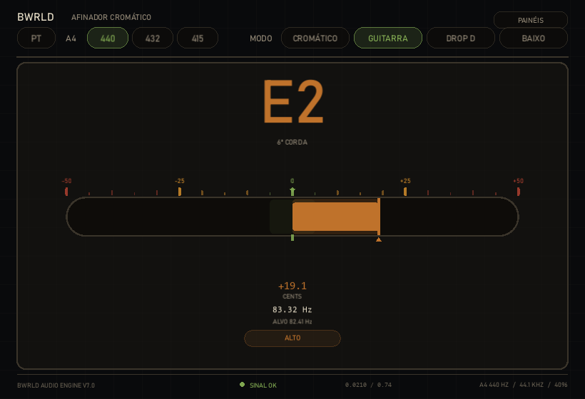

# BWRLD Tuner

[](https://github.com/matheusbutexistworld/bwrld_tuner/actions/workflows/tests.yml)


Afinador cromático para guitarra e baixo, em tempo real, para desktop.
Detecção de pitch por autocorrelação, interface própria desenhada em canvas, e
uma camada de lógica musical pura coberta por testes.



---

## O que ele faz

| | |
|---|---|
| **Modos** | Cromático, Guitarra, Drop D, Baixo, e trava manual em corda específica |
| **Afinação de referência** | 440 Hz (padrão), 432 Hz e 415 Hz (diapasão barroco) |
| **Idiomas** | Português e Inglês, alternáveis em tempo de execução |
| **Faixa** | 30 Hz a 500 Hz — alcança o E1 do baixo (41,20 Hz) |
| **Latência** | blocos de 4096 amostras a 44,1 kHz (~93 ms por leitura) |

A fita indica o desvio em cents: a barra cresce do centro para o lado do erro e
a zona afinada (±5 cents) acende quando você entra nela. Dá para afinar olhando
de canto de olho, com a mão na tarraxa.

<table>
<tr>
<td width="50%"><br><em>Afinado — tudo verde, zona acesa</em></td>
<td width="50%"><br><em>Referência 432 Hz, interface em inglês</em></td>
</tr>
<tr>
<td width="50%"><br><em>Painéis de sinal e de cordas (ocultos por padrão)</em></td>
<td width="50%"><br><em>Janela mínima, 820×560</em></td>
</tr>
</table>

---

## Rodando

Requer Python 3.11+ e uma entrada de áudio (interface, microfone ou captadora).

```bash
git clone https://github.com/matheusbutexistworld/bwrld_tuner.git
cd bwrld_tuner/bwrld_tuner
python -m pip install -r requirements.txt
python main_ponteiro.py
```

Testes (não precisam de áudio nem de interface gráfica):

```bash
python -m pip install -r requirements-dev.txt
pytest
```

---

## Arquitetura

A regra que organiza o projeto: **`core/` não importa `kivy` nem `sounddevice`.**

```
bwrld_tuner/
├── core/                    lógica pura, testável, sem I/O
│   ├── notes.py             cents, MIDI, nota mais próxima
│   ├── tunings.py           presets de corda, escala por afinação de referência
│   ├── tuner_engine.py      frequência -> nota, alvo, cents, status
│   ├── tracking.py          continuidade: erro de oitava e salto espúrio
│   ├── smoothing.py         mediana deslizante
│   ├── gate.py              histerese ativo / hold / standby
│   ├── pipeline.py          orquestra gate -> suavização -> engine
│   ├── i18n.py              traduções
│   └── version.py           versão em um lugar só
├── tests/                   174 testes, 98% de cobertura em core/
├── tuner_pro.py             detecção de pitch (autocorrelação via FFT)
└── main_ponteiro.py         áudio + desenho, nenhuma matemática musical
```

Um quadro de áudio percorre:

```
sounddevice → tuner_pro (freq, rms, clarity) → PitchTracker → SignalGate
                                                     ↓
                          UI ← TunerResult ← TunerEngine ← MedianSmoother
```

O `core/` é assim de propósito: ele é o que será portado para C++/JUCE quando o
projeto virar plugin VST3. Código novo lá evita numpy e usa só `math`.

---

## Decisões de engenharia

Algumas coisas que valem uma olhada no código:

### Erro de oitava não dá para detectar em um quadro isolado

Detectores por autocorrelação erram principalmente em oitava: travam no 2º
harmônico e reportam o dobro da frequência. A versão anterior tentava filtrar
comparando o desvio contra a nota alvo — o que **nunca funcionou**, porque uma
oitava acima de E2 é E3, uma nota perfeitamente válida a 0 cents de si mesma.
(O limiar era 85 cents; varrendo 30–500 Hz, o desvio máximo possível é 50,00.)

A informação está na relação entre quadros **consecutivos**: instrumento nenhum
salta 1200 cents em 93 ms sozinho. [`core/tracking.py`](bwrld_tuner/core/tracking.py)
compara cada leitura com a anterior:

| Situação | Decisão | Efeito na tela |
|---|---|---|
| Variação < 150 cents | `ACCEPTED` | usa a leitura |
| Salto de ~1200 cents | `OCTAVE_FIXED` | dobra de volta para a oitava certa |
| Salto isolado sem forma | `REJECTED` | segura o último quadro |
| Salto que se repete | `RETUNED` | adota a nota nova |

Salto de oitava exige mais confirmação (5 quadros ≈ 460 ms) que salto comum
(2 quadros ≈ 190 ms): travar no harmônico é o erro mais frequente do detector, e
tocar exatamente uma oitava acima é a mudança menos frequente do músico.

### Distância musical é logarítmica

Escolher a corda mais próxima por `abs(freq - alvo)` em Hz enviesa para a corda
mais grave. A fronteira entre E2 (82,41) e A2 (110,00) é a média **geométrica**
(95,21 Hz), não a aritmética (96,20 Hz) — e a diferença cai justamente na faixa
onde o músico chega desafinado. A busca é feita em cents.

### Uma thread decide, a outra só entrega números

O callback do `sounddevice` roda em thread própria. Antes ele escrevia no
histórico de frequências enquanto a thread da interface o esvaziava fora do
lock — `np.median()` sobre um deque sendo limpo devolve `nan`. Hoje a thread de
áudio só entrega uma tupla `(freq, rms, clarity)`; toda decisão musical acontece
em um lugar só.

### Geometria com fonte única

A posição de cada controle é definida por uma função só
(`mode_button_rects`, `preset_row_rects`, `reference_button_rects`...), lida
tanto por quem desenha quanto por quem trata o clique. Sem isso, mexer no layout
desalinha os cliques silenciosamente. Um script de verificação clica no centro
de cada retângulo em três tamanhos de janela e nos dois estados de painel.

---

## Testes

```
174 passed
core/i18n.py        100%      core/tracking.py    100%
core/pipeline.py    100%      core/tunings.py     100%
core/smoothing.py   100%      core/version.py     100%
core/tuner_engine.py 99%      core/gate.py         97%
core/notes.py        97%      TOTAL                98%
```

Rodam no CI em Python 3.11 e 3.12, sem `kivy` e sem `sounddevice` instalados —
o que também serve de prova de que `core/` continua puro.

Dois detalhes que tornam a suíte confiável:

- **O tempo é controlado pelos testes** (`now=` em vez de `time.time()`), o que
  torna o gate e o rastreador determinísticos em vez de dependentes de relógio.
- **A regra de arquitetura é testada**, não só documentada:
  [`test_architecture.py`](bwrld_tuner/tests/test_architecture.py) lê o AST de
  cada módulo de `core/` e falha se algum importar `kivy`, `sounddevice` ou a
  camada de aplicação.

---

## Estado e próximos passos

**Versão atual: 7.0 — Analog Edition.**

O maior buraco conhecido é `tuner_pro.py`: a detecção de pitch em si não tem
teste nenhum, é o único 0% do relatório de cobertura. Ele é o próximo alvo, e
precisa vir antes de qualquer port para C++.

Depois disso, na ordem: adaptar o layout para telas pequenas, portar o `core/`
para TypeScript numa versão web, e então o plugin VST3 em JUCE.

O planejamento completo está em
[BWRLD_Tuner_Roadmap_Refactor_Testes_Mobile_Web_VST.md](bwrld_tuner/BWRLD_Tuner_Roadmap_Refactor_Testes_Mobile_Web_VST.md).
